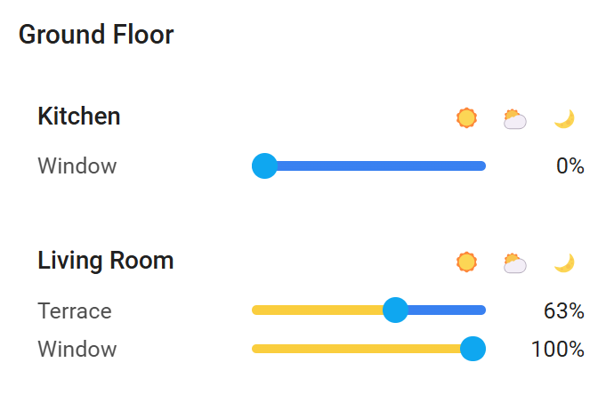
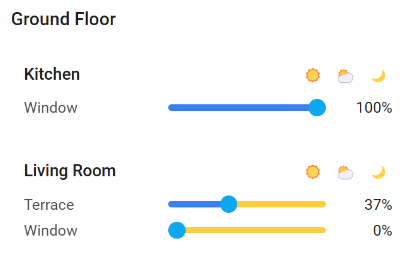
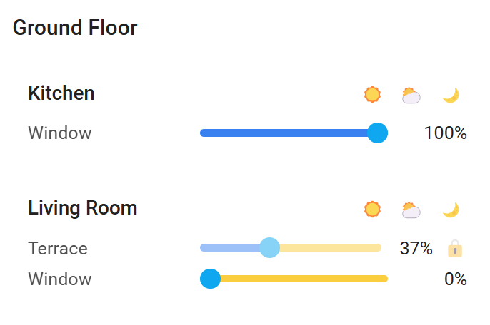

# Compact Cover Control Card

A space-efficient custom card for Home Assistant that provides an intuitive interface for controlling multiple cover entities organized by rooms. Perfect for managing blinds, shades, and other cover entities across your home.

[](https://github.com/hacs/integration)
[](https://github.com/jo-ket/compact-cover-control-card/releases)
[](https://github.com/jo-ket/compact-cover-control-card/releases)
[](https://github.com/jo-ket/compact-cover-control-card/commits/master)

## Features

- 🏠 Group covers by rooms for organized control
- 🎚️ Individual sliders with visual position indication
- 🔒 Optional lock functionality for weather protection or safety interlocks
- 🎯 Customizable positions for all three quick actions (sun, middle, moon)
- 🔄 Support for KNX-style percentage inversion
- ⚡ Quick actions for entire rooms (open, middle position, close)
- 🎨 Gradient visualization of cover positions
- 🌞 Lux-based automated cover control
- ⏱️ Time-based automation constraints
- 🏃‍♂️ Responsive design with Home Assistant theme integration

## Installation

### HACS Installation

1. Make sure [HACS](https://hacs.xyz/) is installed in your Home Assistant instance
2. Add this repository as a custom repository in HACS:
   - Go to HACS > Frontend 
   - Click the three dots in the top right corner
   - Select "Custom repositories"
   - Add `https://github.com/jo-ket/compact-cover-control-card` with category "Dashboard"
3. Click "Install" to install the card
4. Add the card to your dashboard

## Configuration Options

| Name | Type | Default | Description |
|------|------|---------|-------------|
| `title` | string | *optional* | Card title |
| `invert_percentage` | boolean | `false` | Invert percentage display (useful for KNX covers where 0% means open and 100% means closed) |
| `middle_position` | number | `50` | Default middle position (0-100) for all covers |
| `sun_position` | number | `100` | Default sun/open position (0-100) for all covers |
| `moon_position` | number | `0` | Default moon/closed position (0-100) for all covers |
| `lux_automation` | array | *optional* | List of light-based automation rules for all covers |
| `rooms` | array | *required* | List of room configurations |

### Room Configuration

| Name | Type | Default | Description |
|------|------|---------|-------------|
| `name` | string | *required* | Room name |
| `middle_position` | number | *optional* | Override default middle position for this room |
| `sun_position` | number | *optional* | Override default sun/open position for this room |
| `moon_position` | number | *optional* | Override default moon/closed position for this room |
| `lux_automation` | array | *optional* | List of light-based automation rules for this room |
| `covers` | array | *required* | List of cover configurations |

### Cover Configuration

| Name | Type | Default | Description |
|------|------|---------|-------------|
| `name` | string | *required* | Cover name |
| `entity` | string | *required* | Cover entity ID |
| `lock_entity` | string | *optional* | Entity ID for lock control (when state is 'on', cover controls are disabled) |
| `middle_position` | number | *optional* | Override middle position for this specific cover |
| `sun_position` | number | *optional* | Override sun/open position for this specific cover |
| `moon_position` | number | *optional* | Override moon/closed position for this specific cover |
| `lux_automation` | array | *optional* | List of light-based automation rules for this specific cover |

### Lux Automation Configuration

| Name | Type | Default | Description |
|------|------|---------|-------------|
| `entity` | string | *required* | Lux sensor entity ID |
| `position` | number | *required* | Target position (0-100) when conditions are met |
| `above` | number | *optional* | Minimum lux threshold to trigger automation |
| `below` | number | *optional* | Maximum lux threshold to trigger automation |
| `after` | object | *optional* | Time after which automation should run |
| `before` | object | *optional* | Time before which automation should run |

#### Time Configuration

| Name | Type | Default | Description |
|------|------|---------|-------------|
| `hour` | number | *required* | Hour (0-23) |
| `minute` | number | *required* | Minute (0-59) |

## Usage Examples

### Minimal Configuration

```yaml
type: custom:compact-cover-control-card
rooms:
  - name: Living Room
    covers:
      - name: Window
        entity: cover.living_room_window
```

### Configuration with Custom Positions

```yaml
type: custom:compact-cover-control-card
title: House Blinds
# Global positions for all covers
sun_position: 95      # Sun button opens to 95% instead of 100%
middle_position: 60   # Middle button goes to 60% instead of 50%
moon_position: 5      # Moon button closes to 5% instead of 0%
rooms:
  - name: Living Room
    # Room-level overrides
    sun_position: 90
    middle_position: 50
    covers:
      - name: Main Window
        entity: cover.living_room_main
        # Cover-specific override (highest priority)
        sun_position: 85
        middle_position: 45
        moon_position: 10
      - name: Side Window
        entity: cover.living_room_side
        # This cover will use room-level positions
  - name: Bedroom
    covers:
      - name: Window Left
        entity: cover.bedroom_left
        # This cover will use global card-level positions
      - name: Window Right
        entity: cover.bedroom_right
```

### Complete Configuration with Lux Automation

```yaml
type: custom:compact-cover-control-card
title: House Blinds
invert_percentage: true
middle_position: 70
sun_position: 95
moon_position: 5
# Card-level automation for all covers
lux_automation:
  - entity: sensor.outdoor_lux
    above: 20000          # Very bright sun
    position: 20          # Mostly closed for sun protection
    after:                # Only in daytime
      hour: 9
      minute: 0
    before:
      hour: 18
      minute: 0
rooms:
  - name: Living Room
    middle_position: 60
    sun_position: 90
    # Room-level automation
    lux_automation:
      - entity: sensor.living_room_lux
        below: 100        # When it gets dark
        position: 0       # Close completely
        after:            # Only in evening
          hour: 18
          minute: 0
    covers:
      - name: Main Window
        entity: cover.living_room_main
        lock_entity: binary_sensor.living_room_window_open
        middle_position: 50
        sun_position: 85
        moon_position: 10
        # Cover-specific automation
        lux_automation:
          - entity: sensor.main_window_lux
            above: 5000    # Moderate sunlight
            below: 15000   # Not too bright
            position: 60   # Partially open
      - name: Side Window
        entity: cover.living_room_side
        lock_entity: binary_sensor.weather_protection
  - name: Bedroom
    covers:
      - name: Window Left
        entity: cover.bedroom_left
      - name: Window Right
        entity: cover.bedroom_right
```

## Special Features

### Customizable Position Control
All three quick action buttons can now be customized:

- **Sun icon (☀️)** - Configurable `sun_position` (default: 100%)
- **Sun-with-clouds icon (⛅)** - Configurable `middle_position` (default: 50%)  
- **Moon icon (🌙)** - Configurable `moon_position` (default: 0%)

Each position follows the same hierarchy:
1. Cover-specific setting (highest priority)
2. Room-level setting
3. Card-level setting  
4. Built-in default (lowest priority)

This allows you to:
- Set different "fully open" positions for different types of covers
- Have partial closing positions that still provide privacy
- Accommodate covers that shouldn't go to 100% or 0% due to mechanical constraints

### Lux-Based Automation
The card supports built-in lux-based automation for covers, allowing them to respond automatically to changing light conditions:

- Can be configured at card, room, or cover level
- Supports multiple rules with different conditions
- Rules are evaluated in order (cover-specific rules first)
- First matching rule is applied
- Positions are only changed when needed (checks current position)
- Time constraints allow for daylight/evening-specific behaviors
- Automations only run when relevant sensor values change

This feature is particularly useful for:
- Closing blinds during bright sunlight to prevent overheating
- Opening blinds when light levels are comfortable
- Closing blinds in the evening when it gets dark
- Creating different behaviors for different times of day

### KNX Integration
The `invert_percentage` option is particularly useful for KNX installations where the cover percentage is inverted compared to Home Assistant's standard (in KNX, 0% typically means fully open, while in Home Assistant 0% means fully closed). Enable this option to match your KNX cover behavior while maintaining an intuitive user interface.

### Lock Functionality
The `lock_entity` option allows you to disable cover controls based on the state of another entity. This is useful for:
- Weather protection (disable controls during high winds)
- Safety interlocks (prevent operation when windows are open)
- Child safety (disable specific covers when needed)
- Maintenance mode

The cover controls will be disabled when the lock entity state is 'on'.

### Position Control
- Room-level quick actions (☀️, ⛅, 🌙) control all covers in the room
- Individual sliders provide fine-grained control
- All positions (sun, middle, moon) are customizable at card, room, or cover level
- Visual gradient indicates current position with blue (closed) to yellow (open) transition

## Screenshots

<div align="center">
Standard View with Home Assistant Cover Percentages



Inverted Percentages for KNX Integration



Lock Functionality (Weather Protection / Safety Interlock)


</div>

## Development

This card follows the Home Assistant development recommendations and is built using the following technologies:
- TypeScript
- Lit Elements

### Building From Source

1. Clone the repository
2. Install dependencies
```bash
npm install
```
3. Build
```bash
npm run build
```

## Support

If you find this card useful and want to support its development:

⭐️ Star this repository on GitHub

## Contributing

Contributions are welcome! Please feel free to submit a Pull Request.

## License

This project is under the MIT License. See the LICENSE file for the full license text.